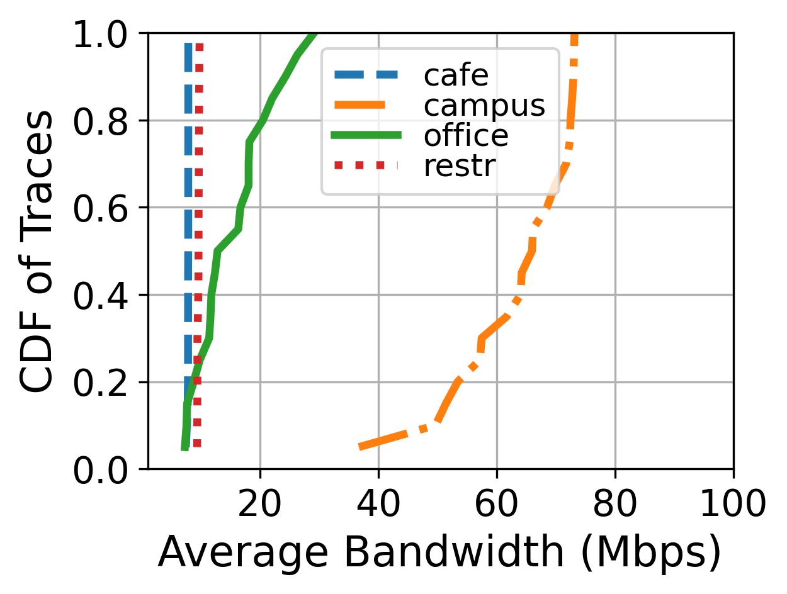

This repository releases a dataset of 80 WiFi bandwidth traces collected in November 2023 in Beijing, China. Please feel free to use these traces.

## Measurement Methodology 

We used iPerf v3.1.3 to measure and record the WiFi link bandwidth. The client and server are located in Beijing and running Ubuntu 18.04. The server command is: ``iperf3 -s -p [SERVER_PORT] -D``, and the client command is: ``iperf3 -c [SERVER_IP] -p [SERVER_PORT] -i 1 -d 200``.

## Dataset Statistics

All traces are collected in static indoor environments, including 4 locations: cafe, campus, office, and restaurant. Each trace lasts 200 seconds, with a granularity of 1 second. Detailed information is shown in the following table and figure:

| Location   | WiFi Information       | Trace Count | Bandwidth Range (Mbps) | Avg. (Mbps) | Std. (Mbps) |
| ---------- | ---------------------- | ----------- | ---------------------- | ----------- | ----------- |
| cafe       | 5GHz WiFi 4 (802.11n)  | 20          | 7.448~7.867            | 7.812       | 0.099       |
| campus     | 5GHz WiFi 5 (802.11ac) | 20          | 36.709~73.165          | 63.750      | 9.754       |
| office     | 5GHz WiFi 5 (802.11ac) | 20          | 7.282~29.124           | 15.532      | 6.334       |
| restaurant | 5GHz WiFi 6 (802.11ax) | 20          | 9.362~9.807            | 9.567       | 0.133       |

```javascript
<p align="left">
    
</p>
```

## Dataset Format

File name format: ``wifi_[location]_[time].txt``

- ``[location]``: ["cafe", "campus", "office", "restr"]
- ``[time]``: start time of a trace (GMT+8); the format in Python is "%y%m%d-%H%M%S"

Trace data format (each line in a trace): ``[Timestamp (s)]\t[Bandwidth (Mbps)]``